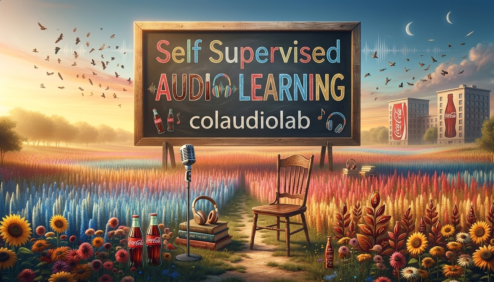

# Awesome-Self-Supervised-Audio-Learning

[//]: # (# Self-Supervised Audio Learning)

<p align="center">
  
</p>

[](https://github.com/colaudiolab/Awesome-Self-Supervised-Audio-Learning) 
[](https://opensource.org/licenses/MIT)
[](https://github.com/colaudiolab/Awesome-Self-Supervised-Audio-Learning)
[](xxx) 
[](https://visitor-badge.laobi.icu/badge?page_id=colaudiolab.Awesome-Self-Supervised-Audio-Learning)

The repository is based on our survey [A Systematic Review on Self-Supervised Learning for Audio Signal: Taxonomy, Applications and Future Trends](xxx) (Submit to TPAMI 2026).

xxx, Kele Xu

National University of Defense Technology(NUDT)

## Abstract
This survey provides a comprehensive and systematic review of self-supervised learning (SSL) in audio signal processing, tracing its evolution from early heuristic-based pretext tasks to the current era of Native Large Audio Language Models (LALMs) and omni-modal foundation models. We propose a multidimensional taxonomy that categorizes SSL methods into five dominant paradigms: early auxiliary tasks, contrastive discrimination, generative reconstruction, discrete semantic prediction, and multimodal alignment. Unlike previous reviews, this paper explicitly analyzes the role of architectural inductive biases—ranging from the locality of CNNs to the global context modeling of Transformers and the linear-time efficiency of modern State Space Models (SSMs) like Mamba.
Furthermore, we evaluate the impact of SSL across diverse domains, including next-generation speech processing, environmental sound analysis, music information retrieval (MIR), and healthcare bioacoustics. A significant focus is placed on recent breakthroughs, such as Neural Codec Language Models (NCLMs), Flow Matching paradigms (e.g., F5-TTS), and the integration of deep reasoning mechanisms through post-training techniques like Group Relative Policy Optimization (GRPO). We also provide an exhaustive overview of standardized benchmark suites (e.g., SUPERB, HEAR, AudioBench) and formal mathematical definitions of core evaluation metrics. Finally, we discuss the ``perceptual bottleneck'' and security vulnerabilities as primary challenges, and outline future trends toward physics-informed, 4D audio-visual intelligence and unified end-to-end omni-modal reasoning.

## 📢 News!!!

📌 We are actively tracking the latest research and welcome contributions to our repository and survey paper. If your studies are relevant, please feel free to contact us.

[//]: # (📰 2026-xx-xx: Our repository now features a curated list of representative self-supervised audio learning papers published up to Jan 1, 2026.)

📰 2026-xx-xx: Our survey paper has been uploaded to ArXiv.

📰 2026-03-20: Our survey paper has been submitted to TPAMI 2026.


## 🔍 BibTeX
If you find this work helpful in your research, welcome to cite the paper and give a ⭐.

```

```


## Table of contents
- [Papers](#papers)
  - <details>
    <summary>Early Auxiliary Tasks</summary>
    
    
    </details>
  - <details>
    <summary>Contrastive Learning</summary>
    
    
    </details>
  - <details>
    <summary>Generative and Reconstruction</summary>
    
    
    </details>
  - <details>
    <summary>Discrete Token Prediction</summary>
    
    
    </details>
  - <details>
    <summary>Teacher-Student Distillation and Unified Learning</summary>
    
    
    </details>
  - <details>
    <summary>Multimodal Alignment</summary>
    
    
    </details>
- [Benchmarking, Datasets, and Evaluation Protocols](#benchmarking-datasets-and-evaluation-protocols)
  - <details>
    <summary>Speech-centric Benchmarks</summary>
    
    
    </details>
  - <details>
    <summary>Environmental and General Audio</summary>
    
    
    </details>
  - <details>
    <summary>Audio-Language (Multimodal)</summary>
    
    
    </details>
  - <details>
    <summary>Audio-Visual and Audio-LLM</summary>
    
    
    </details>
- [Star History](#star-history)

    
# Papers

## 1. Early Auxiliary Tasks
| Title | Publication | Date |
| :--- | :--- | :--- |
| [A Novel Method of Artificial Bandwidth Extension Using Deep Architecture](https://www.researchgate.net/publication/354167437_A_novel_method_of_artificial_bandwidth_extension_using_deep_architecture) | Interspeech 2015 | 2015.09 |
| [Shuffle and Learn: Unsupervised Learning using Temporal Order Verification](https://arxiv.org/abs/1603.08561) | ECCV 2016 | 2016.03 |
| [Context Encoders: Feature Learning by Inpainting](https://ieeexplore.ieee.org/document/7780647) | CVPR 2016 | 2016.04 |
| [Look, Listen and Learn](https://arxiv.org/abs/1705.08168) | ICCV 2017 | 2017.05 |
| [Audio Super Resolution Using Neural Networks](https://arxiv.org/abs/1708.00853) | ICLR 2017 Workshop | 2017.08 |
| [Unsupervised Representation Learning by Predicting Image Rotations](https://arxiv.org/abs/1803.07728) | ICLR 2018 | 2018.03 |
| [Learning Problem-agnostic Speech Representations from Multiple Self-supervised Tasks](https://arxiv.org/abs/1904.03416) | Interspeech 2019 | 2019.04 |
| [A Context Encoder for Audio Inpainting](https://ieeexplore.ieee.org/document/8867915) | IEEE TASLP 2019 | 2019.10 |
| [Multi-task self-supervised learning for Robust Speech Recognition](https://arxiv.org/abs/2001.09239) | ICASSP 2020 | 2020.01 |
| [Pre-Training Audio Representations With Self-Supervision](https://ieeexplore.ieee.org/document/9060816) | IEEE SPL 2020 | 2020.04 |
| [Self-Supervised Learning of Audio Representations from Permutations with Differentiable Ranking](https://ieeexplore.ieee.org/document/9382070) | IEEE SPL 2021 | 2021.03 |
| [Self-Supervised Speech Representation Learning: A Review](https://ui.adsabs.harvard.edu/abs/2022ISTSP..16.1179M/abstract) | IEEE JSTSP 2022 | 2022.10 |
| [Audio self-supervised learning: A survey](https://www.sciencedirect.com/science/article/pii/S2666389922002410) | Patterns 2022 | 2022.12 |
| [A survey on self-supervised learning: Algorithms, applications, and future trends](https://arxiv.org/abs/2301.05712) | IEEE TPAMI 2024 | 2024.07 |


## 2. Contrastive Learning
| Title | Publication | Date |
| :--- | :--- | :--- |
| [Representation Learning with Contrastive Predictive Coding](https://arxiv.org/abs/1807.03748) | arXiv 2018 | 2018.07 |
| [wav2vec: Unsupervised Pre-training for Speech Recognition](https://arxiv.org/abs/1904.05862) | Interspeech 2019 | 2019.04 |
| [vq-wav2vec: Self-Supervised Learning of Discrete Speech Representations](https://arxiv.org/abs/1910.05453) | ICLR 2020 | 2019.10 |
| [Contrastive Learning of General-Purpose Audio Representations](https://ieeexplore.ieee.org/document/9413528) | ICASSP 2021 | 2020.10 |
| [wav2vec 2.0: A Framework for Self-Supervised Learning of Speech Representations](https://arxiv.org/abs/2006.11477) | NeurIPS 2020 | 2020.10 |
| [CLAR: Contrastive Learning of Auditory Representations](https://arxiv.org/abs/2010.09542) | AISTATS 2021 | 2020.10 |
| [Speech SIMCLR: Combining Contrastive and Reconstruction Objective for Self-supervised Speech Representation Learning](https://arxiv.org/abs/2010.13991) | Interspeech 2021 | 2020.10 |
| [BYOL for Audio: Self-Supervised Learning for General-Purpose Audio Representation](https://arxiv.org/abs/2103.06695) | IJCNN 2021 | 2021.03 |
| [Contrastive Learning of Musical Representations](https://arxiv.org/abs/2103.09410) | ISMIR 2021 | 2021.03 |
| [BYOL for Audio: Exploring Pre-trained General-purpose Audio Representations](https://arxiv.org/abs/2204.07402) | TASLP 2022 | 2022.04 |
| [Audio Barlow Twins: Self-Supervised Audio Representation Learning](https://ieeexplore.ieee.org/document/10095041) | ICASSP 2023 | 2023.05 |

## 3. Generative and Reconstruction
| Title | Publication | Date |
| :--- | :--- | :--- |
| [APC: An Unsupervised Autoregressive Model for Speech Representation Learning](https://arxiv.org/abs/1904.03240) | Interspeech 2019 | 2019.04 |
| [Mockingjay: Unsupervised Speech Representation Learning with Deep Bidirectional Transformer Encoders](https://arxiv.org/abs/1910.12638) | ICASSP 2020 | 2020.02 | 
| [Audio ALBERT: A Lite BERT for Self-supervised Learning of Audio Representation](https://arxiv.org/abs/2005.08575) | IEEE SLT Workshop 2021 | 2021.05 |
| [TERA: Self-Supervised Learning of Transformer Encoder Representation for Speech](https://ieeexplore.ieee.org/document/9478264) | TASLP 2021 | 2021.07 |
| [SSAST: Self-Supervised Audio Spectrogram Transformer](https://arxiv.org/abs/2110.09784) | AAAI 2022 | 2022.02 |
| [MAE-AST: Masked Autoencoding Audio Spectrogram Transformer](https://arxiv.org/abs/2203.16691) | Interspeech 2022 | 2022.03 |
| [Masked Spectrogram Prediction For Self-Supervised Audio Pre-Training](https://arxiv.org/abs/2204.12768) | ICASSP 2023 | 2022.04 |
| [Masked Autoencoders that Listen](https://arxiv.org/abs/2207.06405) | NeurIPS 2022 | 2022.07 |
| [NaturalSpeech 3: Zero-Shot Speech Synthesis with Factorized Codec and Diffusion Models](https://arxiv.org/abs/2403.03100) | ICML 2024 | 2024.03 |
| [AudioLDM 2: Learning Holistic Audio Generation with Self-supervised Pretraining](https://ieeexplore.ieee.org/document/10530074) | TASLP 2024 | 2024.05 |
| [MaskGCT: Zero-Shot Text-to-Speech with Masked Generative Codec Transformer](https://arxiv.org/abs/2409.00750) | ICLR 2025 | 2024.09 |

## 4. Discrete Token Prediction
| Title | Publication | Date |
| :--- | :--- | :--- |
| [HuBERT: Self‐Supervised Speech Representation Learning by Masked Prediction of Hidden Units](https://arxiv.org/abs/2106.07447) | TASLP 2021 | 2021.06 |
| [W2v-BERT: Combining Contrastive Learning and Masked Language Modeling for Self-Supervised Speech Pre-Training](https://arxiv.org/abs/2108.06209) | ASRU 2021 | 2021.08 |
| [WavLM: Large-Scale Self-Supervised Pre-Training for Full Stack Speech Processing](https://arxiv.org/abs/2110.13900) | IEEE JSTSP 2022 | 2021.08 |
| [Self-supervised Learning with Random-projection Quantizer for Speech Recognition](https://arxiv.org/abs/2202.01855) | ICML 2022 | 2022.02 |
| [AudioLM: a Language Modeling Approach to Audio Generation](https://arxiv.org/abs/2209.03143) | TASLP 2023 | 2022.09 |
| [BEATs: Audio Pre-Training with Acoustic Tokenizers](https://arxiv.org/abs/2212.09058) | ICML 2023 | 2022.12 |
| [Seed-TTS: A Family of High-Quality Versatile Speech Generation Models](https://arxiv.org/abs/2406.02430) | arXiv 2024 | 2024.06 |
| [VALL-E 2: Neural Codec Language Models are Human Parity Zero-Shot Text to Speech Synthesizers](https://arxiv.org/abs/2406.05370) | arXiv 2024 | 2024.06 |
| [Samba-ASR: State-Of-The-Art Speech Recognition Leveraging Structured State-Space Models](https://arxiv.org/abs/2501.02832) | arXiv 2025 | 2025.01 |
| [MIM-Refiner: A Contrastive Learning Boost from Intermediate Pre-Trained Representations](https://arxiv.org/abs/2402.10093) | ICLR 2025 | 2025.02 |

## 5. Teacher-Student Distillation and Unified Learning
| Title | Publication | Date |
| :--- | :--- | :--- |
| [Multi-task self-supervised learning for Robust Speech Recognition](https://arxiv.org/abs/2001.09239) | ICASSP 2020 | 2020.01 |
| [Data2vec: A general framework for self-supervised learning in speech, vision and language](https://arxiv.org/abs/2202.03555) | ICML 2022 | 2022.02 |
| [ATST: Audio Representation Learning with Teacher-Student Transformer](https://arxiv.org/abs/2204.12076) | Interspeech 2022 | 2022.04 |
| [BYOL-S: Learning Self-supervised Speech Representations by Bootstrapping](https://arxiv.org/abs/2206.12038) | NeurIPS 2021 Competition | 2022.06 |
| [EAT: Self-Supervised Pre-Training with Efficient Audio Transformer](https://arxiv.org/abs/2401.03497) | IJCAI 2024 | 2024.01 |
| [DinoSR: Self-Distillation and Online Clustering for Self-supervised Speech Representation Learning](https://arxiv.org/abs/2305.10005) | NeurIPS 2023 | 2024.01 |
| [HeAR -- Health Acoustic Representations](https://arxiv.org/abs/2403.02522) | arXiv 2024 | 2024.03 |
| [SSLAM: Enhancing Self-Supervised Models with Audio Mixtures for Polyphonic Soundscapes](https://arxiv.org/abs/2506.12222) | ICLR 2025 | 2025.06 |
| [ASDA: Audio Spectrogram Differential Attention Mechanism for Self-Supervised Representation Learning](https://arxiv.org/abs/2507.02666) | Interspeech 2025 | 2025.07 |
| [JoVA: Unified Multimodal Learning for Joint Video-Audio Generation](https://arxiv.org/abs/2512.13677) | arXiv 2025 | 2025.12 |


## 6. Multimodal Alignment
| Title | Publication | Date |
| :--- | :--- | :--- |
| [SoundNet: Learning Sound Representations from Unlabeled Video](https://arxiv.org/abs/1610.09001) | NeurIPS 2016 | 2016.10 |
| [Look, Listen and Learn](https://arxiv.org/abs/1705.08168) | ICCV 2017 | 2017.05 |
| [Robust Audio-Visual Instance Discrimination](https://arxiv.org/abs/2103.15916) | CVPR 2021 | 2021.03 |
| [Vatt: Transformers for multimodal self-supervised learning from raw video, audio and text](https://arxiv.org/abs/2104.11178) | NeurIPS 2021 | 2021.04 |
| [AudioCLIP: Extending CLIP to Image, Text and Audio](https://arxiv.org/abs/2106.13043) | GCPR 2021 | 2021.06 |
| [Learning Audio-Visual Speech Representation by Masked Multimodal Cluster Prediction](https://arxiv.org/abs/2201.02184) | ICLR 2022 | 2022.01 |
| [Large-scale Contrastive Language-Audio Pretraining with Feature Fusion and Keyword-to-Caption Augmentation](https://arxiv.org/abs/2211.06687) | ICASSP 2023 | 2022.11 |
| [Contrastive Audio-Visual Masked Autoencoder](https://arxiv.org/abs/2210.07839) | ICLR 2023 | 2023.04 |
| [ImageBind: One Embedding Space To Bind Them All](https://arxiv.org/abs/2305.05665) | CVPR 2023 | 2023.05 |
| [Qwen-Audio: Advancing Universal Audio Understanding via Unified Large-Scale Audio-Language Models](https://arxiv.org/abs/2311.07919) | arXiv 2023 | 2023.11 |
| [SALMONN: Towards Generic Hearing Abilities for Large Language Models](https://arxiv.org/abs/2310.13289) | ICLR 2024 | 2024.04 |


# Benchmarking, Datasets, and Evaluation Protocols

## 1. Speech-oriented SSL Benchmark Suites
| Title | Publication | Date |
| :--- | :--- | :--- |
| [SUPERB: Speech processing Universal PERformance Benchmark](https://arxiv.org/abs/2105.01051) | Interspeech 2021 | 2021.05 |
| [SUPERB-SG: Enhanced Speech processing Universal PERformance Benchmark for Semantic and Generative Capabilities](https://arxiv.org/abs/2203.06849) | ACL 2022 | 2022.03 |
| [The Zero Resource Speech Benchmark 2021: Metrics and baselines for unsupervised spoken language modeling](https://arxiv.org/abs/2011.11588) | NeurIPS 2020 Workshop | 2020.11 |
| [Task Agnostic and Task Specific Self-Supervised Learning from Speech with LeBenchmark.](https://datasets-benchmarks-proceedings.neurips.cc/paper/2021/hash/b3e3e393c77e35a4a3f3cbd1e429b5dc-Abstract-round2.html) | NeurIPS 2021 Datasets and benchmarks | 2021.12 |

## 2. Low-resource Speech Pretraining Benchmarks
| Title | Publication | Date |
| :--- | :--- | :--- |
| [Libri-Light: A Benchmark for ASR with Limited or No Supervision](https://arxiv.org/abs/1912.07875) | ICASSP 2020 | 2019.12 |

## 3. Environmental and Non-speech Benchmarks


## 4. Universal Audio Representation Suites + Canonical General-Audio Benchmarks
| Title | Publication | Date |
| :--- | :--- | :--- |
| [HEAR 2021: Holistic Evaluation of Audio Representations](https://arxiv.org/abs/2203.03022) | PMLR 2022 | 2022.03 |
| [AudioSet: An ontology and dataset for ILSVRC-like labeled video events](https://ieeexplore.ieee.org/document/7952261) | ICASSP 2017 | 2017.03 |
| [FSD50K: An Open Dataset of Everyday Sounds](https://arxiv.org/abs/2010.00475) | IEEE/ACM TASLP 2021 | 2020.11 |
| [DCASE 2017 Challenge Setup: Tasks, Datasets and Baseline System](https://arxiv.org/abs/1709.03159) | DCASE Workshop 2017 | 2017.09 |
| [Towards Learning to Solve Non-Semantic Speech Tasks with Reviews](https://arxiv.org/abs/2002.01322) | Interspeech 2020 | 2020.02 |

## 5. Audio-Text Multimodal SSL Benchmarks
| Title | Publication | Date |
| :--- | :--- | :--- |
| [AudioCaps: Generating Captions for Audios in the Wild](https://arxiv.org/abs/1905.13448) | NAACL-HLT 2019 | 2019.05 |
| [Clotho: An Audio Captioning Dataset](https://arxiv.org/abs/1910.09387) | ICASSP 2020 | 2019.10 |
| [WavCaps: A ChatGPT-Assisted Weakly-Labelled Audio Captioning Dataset](https://arxiv.org/abs/2303.17395) | arXiv 2023 | 2023.03 |

## 6. Audio-Visual / Audio-Video Multimodal SSL Benchmarks
| Title | Publication | Date |
| :--- | :--- | :--- |
| [AVE: Audio-Visual Event Localization in Real-world Videos](https://arxiv.org/abs/1807.00439) | ECCV 2018 | 2018.07 |
| [VGGSound: A Large-scale Audio-Visual Dataset](https://arxiv.org/abs/2004.14368) | ICASSP 2020 | 2020.04 |
| [AVSBench: Object-level Audio-Visual Segmentation with Grounding](https://arxiv.org/abs/2208.03578) | CVPR 2023 | 2022.08 |
| [AVQA: Learning to Answer Questions in Dynamic Audio-Visual Scenes](https://arxiv.org/abs/2204.04368) | CVPR 2022 | 2022.04 |
| [AudioBench: A Universal Benchmark for Audio Large Language Models](https://arxiv.org/abs/2406.13110) | arXiv 2024 | 2024.06 |

## 7. Audio-Centered Multimodal Evaluation Suites
| Title | Publication | Date |
| :--- | :--- | :--- |

# Star History

[](https://star-history.com/#colaudiolab/Awesome-Self-Supervised-Audio-Learning&Date)
